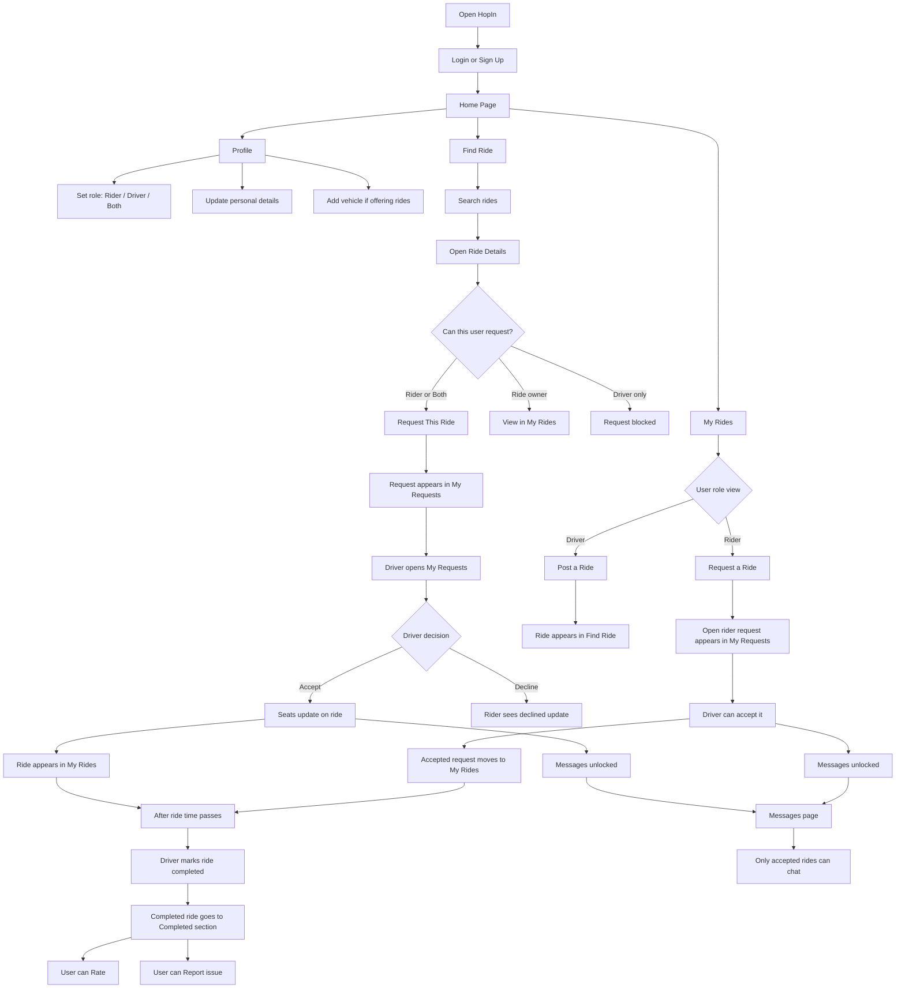

# HopIn

HopIn is our ride-sharing project.  
This version is built with simple HTML, CSS, JavaScript, Bootstrap, jQuery, Node.js, Express.js, and Supabase.

We kept the code and docs beginner-friendly on purpose, so it is easier to learn how the project works page by page.

## What this project can do right now

- sign up and log in
- edit profile details
- save vehicle details
- post a ride
- request a ride
- find rides
- open ride details
- send a booking request on an existing ride
- accept or decline ride requests
- show accepted rides in `My Rides`

`Messages` is still not explained in the docs on purpose because that part is not the focus yet.

## Simple app flow

This is the simple user flow for how someone can use HopIn:



## Tech stack

- Frontend: HTML, CSS, Bootstrap, jQuery
- Backend: Node.js, Express.js
- Database: Supabase
- Pattern: simple MVC

## Project folder

The real app is inside the `Project-App` folder.

If someone clones only this app repo, they can place it anywhere on their machine.

The older prototype files in the parent `HopIn` folder were only used here as visual reference while building.

## Before you run the project

You should have:

- Node.js installed
- npm installed
- a Supabase project created

## Step-by-step setup

### 1. Clone or open the project folder

If you already have the folder, just open it in terminal.

If you are cloning from GitHub:

```powershell
git clone <your-repo-url>
cd Project-App
```

If you already have the code locally:

```powershell
cd Project-App
```

### 2. Install packages

On this machine, PowerShell can block `npm.ps1`, so use `npm.cmd`.

```powershell
npm.cmd install
```

### 3. Create `.env`

Create a file named `.env` in the project root.

Use this:

```env
PORT=3000
SUPABASE_URL=your-supabase-url
SUPABASE_ANON_KEY=your-supabase-anon-key
```

This project is using only:

- `SUPABASE_URL`
- `SUPABASE_ANON_KEY`

## 4. Run the required Supabase SQL

Open Supabase SQL Editor and run these in this order:

1. `supabase/schema.sql`
2. `supabase/seed.sql`

If you already created your database earlier and your local code is newer than that database, also run these small migration files if needed:

- `supabase/add-open-ride-request-declined-status.sql`
- `supabase/allow-zero-seats-on-full-rides.sql`
- `supabase/add-reports-table.sql`

Fresh databases usually only need:

- `schema.sql`
- `seed.sql`

## 5. Disable RLS for now

If Supabase auto-enabled Row Level Security, run this query too:

```sql
alter table profiles disable row level security;
alter table vehicles disable row level security;
alter table rides disable row level security;
alter table booking_requests disable row level security;
alter table open_ride_requests disable row level security;
alter table messages disable row level security;
alter table ratings disable row level security;
alter table reports disable row level security;
alter table schedules disable row level security;
```

## 6. Optional sample data for rides and vehicles

`seed.sql` only adds the 8 profiles.

If you also want the app to show ride cards right away on Home, Find Ride, Ride Details, My Requests, and My Rides, add some vehicles and rides too.

### Add 4 sample vehicles

```sql
insert into vehicles (
  user_id,
  make,
  model,
  vehicle_year,
  color,
  license_plate,
  seats_available
)
values
  ('11111111-1111-4111-8111-111111111111', 'Toyota', 'Corolla', 2020, 'White', 'ABC 123', 3),
  ('22222222-2222-4222-8222-222222222222', 'Honda', 'Civic', 2021, 'Black', 'DEF 456', 2),
  ('33333333-3333-4333-8333-333333333333', 'Hyundai', 'Elantra', 2019, 'Blue', 'GHI 789', 3),
  ('44444444-4444-4444-8444-444444444444', 'Mazda', 'CX-5', 2022, 'Grey', 'JKL 321', 1);
```

### Add 4 sample rides

```sql
insert into rides (
  driver_id,
  vehicle_id,
  origin,
  destination,
  ride_date,
  ride_time,
  seats_available,
  notes,
  status
)
values
  (
    '11111111-1111-4111-8111-111111111111',
    null,
    'Albert Park',
    'University of Regina',
    '2026-03-20',
    '07:45',
    3,
    'Morning campus ride. Pickup near the main Albert Park area.',
    'open'
  ),
  (
    '22222222-2222-4222-8222-222222222222',
    null,
    'Normanview',
    'Downtown',
    '2026-03-20',
    '08:15',
    2,
    'Weekday downtown commute with one short pickup stop.',
    'open'
  ),
  (
    '33333333-3333-4333-8333-333333333333',
    null,
    'Harbour Landing',
    'Wascana Centre',
    '2026-03-21',
    '09:00',
    3,
    'Late morning ride with flexible drop-off nearby.',
    'open'
  ),
  (
    '44444444-4444-4444-8444-444444444444',
    null,
    'Lakeview',
    'University of Regina',
    '2026-03-22',
    '13:30',
    1,
    'Afternoon ride for students heading toward campus.',
    'open'
  );
```

### Link rides to each driver's vehicle

```sql
update rides
set vehicle_id = vehicles.id
from vehicles
where rides.driver_id = vehicles.user_id
  and rides.vehicle_id is null;
```

## 7. Start the project

```powershell
npm.cmd run dev
```

Then open:

- [http://localhost:3000](http://localhost:3000)

## 8. Recommended testing order

This is the order our group would test:

1. sign up or log in
2. update profile page
3. update vehicle page
4. add a few rides
5. test `Find Ride`
6. open ride details
7. request an existing ride
8. accept the request as the driver
9. check `My Requests`
10. check `My Rides`

## Important note for posting rides

Before a driver can properly post a ride, that user should have a vehicle saved first in:

- `Profile -> My Vehicle`

Without a vehicle, the app now shows a warning instead of posting silently.

## Important note for roles

The app now respects profile role in many places:

- `rider` can only use rider pages/actions
- `driver` can only use driver pages/actions
- `both` can use both

## Main pages

- `/`
- `/find-ride`
- `/ride-details`
- `/my-requests`
- `/my-rides`
- `/profile-settings`
- `/messages`

## Main database tables

- `profiles`
- `vehicles`
- `rides`
- `booking_requests`
- `open_ride_requests`
- `ratings`
- `schedules`
- `messages`

## Docs to read next

Start here:

- [docs/README.md](./docs/README.md)

Best docs for learning the project:

- [docs/profile-page/README.md](./docs/profile-page/README.md)
- [docs/home-find-rides/README.md](./docs/home-find-rides/README.md)
- [docs/my-requests/README.md](./docs/my-requests/README.md)
- [docs/my-rides/README.md](./docs/my-rides/README.md)
- [docs/database-schema.md](./docs/database-schema.md)

## Small note

These docs were written in a simple style on purpose.  
The goal is to keep them easy to read like a student project document.
