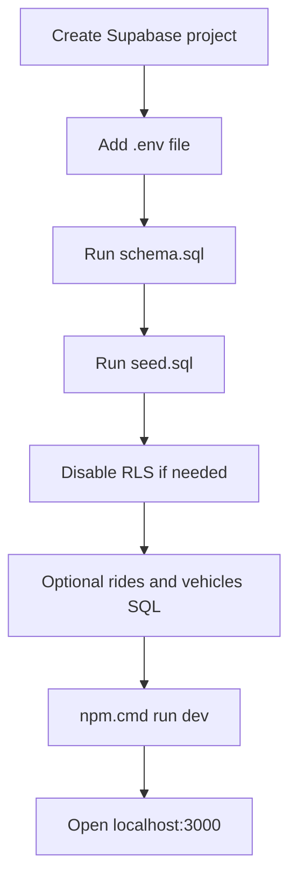

# Backend Setup Guide

This is the simple setup guide our group would follow on a fresh machine.

## 1. Go into the project

```powershell
cd Project-App
```

## 2. Install packages

Use `npm.cmd` on this machine:

```powershell
npm.cmd install
```

## 3. Create `.env`

Create this file in the project root:

```env
PORT=3000
SUPABASE_URL=your-supabase-url
SUPABASE_ANON_KEY=your-supabase-anon-key
```

This project is using the Supabase anon key only.

## 4. Run the SQL files

Open Supabase SQL Editor and run:

1. `supabase/schema.sql`
2. `supabase/seed.sql`

If your database was created earlier and your code is newer now, also run these migration files when needed:

- `supabase/add-open-ride-request-declined-status.sql`
- `supabase/allow-zero-seats-on-full-rides.sql`
- `supabase/add-reports-table.sql`

## 5. Disable RLS if needed

If RLS was auto-enabled, run:

```sql
alter table profiles disable row level security;
alter table vehicles disable row level security;
alter table rides disable row level security;
alter table booking_requests disable row level security;
alter table open_ride_requests disable row level security;
alter table messages disable row level security;
alter table ratings disable row level security;
alter table reports disable row level security;
alter table schedules disable row level security;
```

## 6. Optional sample vehicles and rides

`seed.sql` adds only the 8 profiles.

If you want the app to show ride cards right away, also add:

1. one vehicle for each demo driver
2. a few rides
3. link rides to vehicles

The full copy-paste SQL is in the root [README.md](../README.md).

## 7. Start the app

```powershell
npm.cmd run dev
```

Open:

- [http://localhost:3000](http://localhost:3000)

## 8. First things to test

### API

- `GET /api/users`
- `GET /api/rides`
- `GET /api/my-requests?userId=11111111-1111-4111-8111-111111111111&view=driver`
- `GET /api/my-rides?userId=66666666-6666-4666-8666-666666666666&view=rider`

### Pages

- `/`
- `/login`
- `/signup`
- `/profile-settings`
- `/find-ride`
- `/my-requests`
- `/my-rides`

## 9. Real data you should add

At minimum, this is the suggested order:

1. seed the 8 profiles
2. create an auth account from `Sign Up` or log in from `Log In`
3. save at least 1 vehicle for each driver or `both` user
4. add a few rides
5. then test booking requests and accepted rides

## 10. Small Mermaid summary


