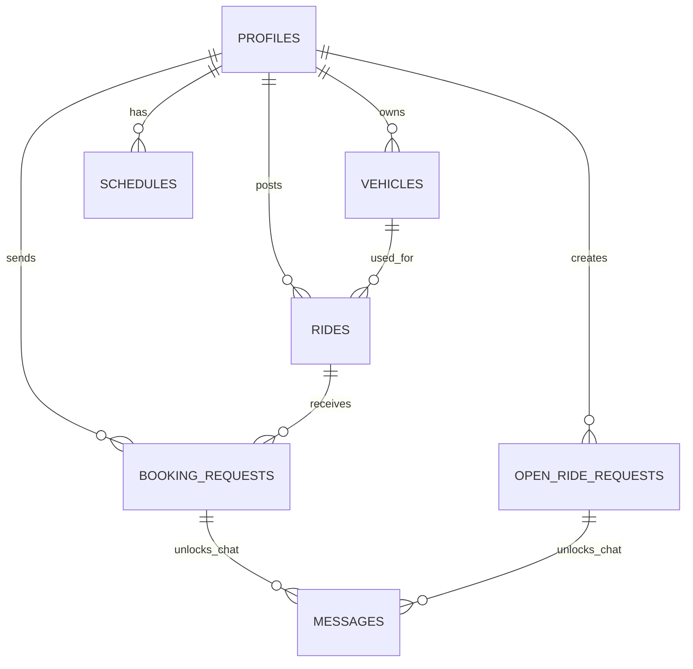
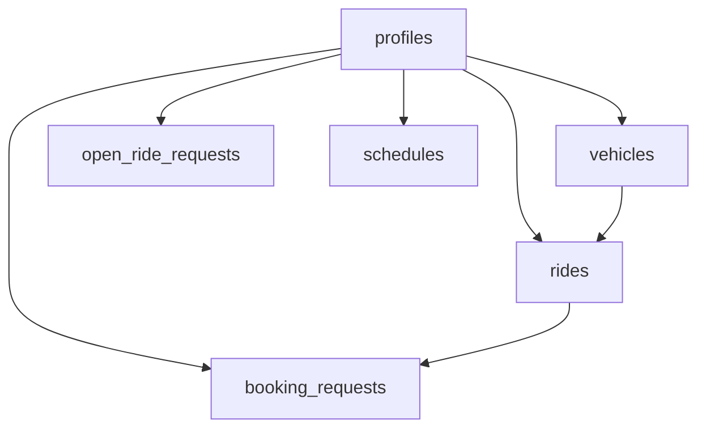

# HopIn Database Schema

This doc explains the tables in a simple way.

## Main tables

- `profiles`
- `vehicles`
- `rides`
- `booking_requests`
- `open_ride_requests`
- `ratings`
- `schedules`
- `messages`

## Main relationship idea

One user can:

- have one or more vehicles
- post rides
- send booking requests
- create open ride requests
- have commute schedules

## ER diagram

## Table purpose

### `profiles`

Main user information:

- name
- email
- role
- phone
- home area
- notes
- rating average

### `vehicles`

Driver vehicle information:

- make
- model
- year
- color
- plate
- seats available

### `rides`

Driver-posted rides:

- driver
- vehicle
- origin
- destination
- date
- time
- seats
- notes
- status

### `booking_requests`

This table is for riders joining an already posted ride.

Important columns:

- `ride_id`
- `rider_id`
- `seats_requested`
- `status`

### `open_ride_requests`

This table is for riders saying:

`I need a ride from A to B at this time`

Important columns:

- `rider_id`
- `accepted_driver_id`
- route
- date and time
- seats needed
- status

### `schedules`

This table is used by the Profile page for commute schedule.

It stores:

- day
- leave time
- return time
- commute from
- commute to

### `ratings`

This stores review rows.

The Profile page mostly shows `profiles.rating_avg` because that is simpler for display.

### `messages`

This table exists, but it is not the focus of the project docs yet.

Important idea:

- messages should only happen after acceptance

## Database flow diagram

## Main page to table mapping

- `Profile page`
  uses `profiles`, `schedules`, `vehicles`

- `Find Ride`
  uses `rides`, plus profile and vehicle info for display

- `Ride Details`
  uses `rides`, `profiles`, `vehicles`, and sometimes `booking_requests`

- `My Requests`
  uses `booking_requests` and `open_ride_requests`

- `My Rides`
  uses `rides`, accepted `booking_requests`, and accepted `open_ride_requests`
