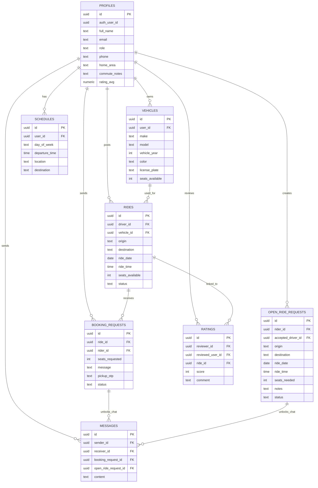

# HopIn Database Schema

## Main tables

- `profiles`
- `vehicles`
- `rides`
- `booking_requests`
- `open_ride_requests`
- `ratings`
- `schedules`
- `messages`

## Diagram

## Important note about messages

Messages are not open by default.

A chat is only allowed when one of these becomes accepted:

- a `booking_request`
- an `open_ride_request`

That is why messages link to a request instead of only linking to a ride.
