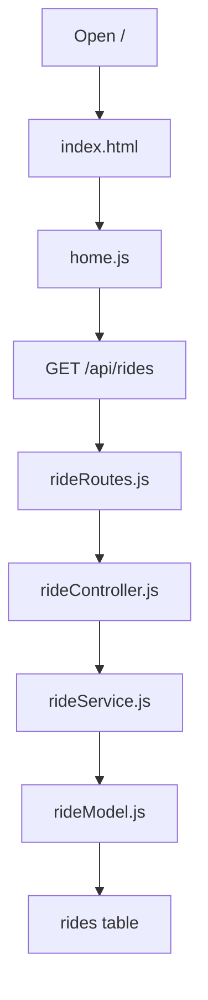
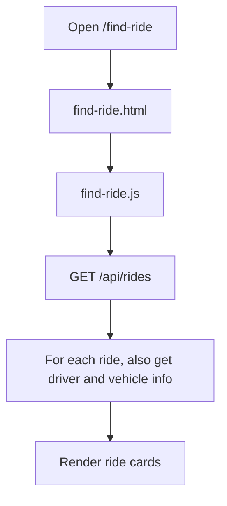
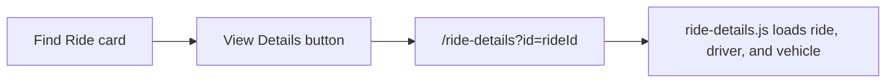

# Home and Find Ride Flow

This doc explains:

- Home page
- Find Ride page
- Ride Details connection

## Main file list

- `public/pages/index.html`
- `public/assets/js/home.js`
- `public/pages/find-ride.html`
- `public/assets/js/find-ride.js`
- `public/pages/ride-details.html`
- `public/assets/js/ride-details.js`

## Home page

The Home page is simple.

It has:

- welcome card
- `Find a Ride` button
- `Become a Driver` button
- `Recent Rides` section

The `Recent Rides` section reads from:

- `/api/rides`

Right now it only shows the first 2 rides.

## Home page data flow

## Find Ride page

This page is for discovery.

It has:

- search bar
- filters
- list view
- Leaflet map view

The page loads rides from the database and then enriches them with:

- driver info from `profiles`
- vehicle info from `vehicles`

## Find Ride page flow

## Search and filter logic

The page filters on the frontend using the rides it already loaded.

It checks:

- search text
- origin
- destination
- date
- seats

The map tab now uses Leaflet with OpenStreetMap tiles and deterministic preview pin points for ride routes.

## Ride Details connection

Every ride card has:

- `View Details`

That opens:

- `/ride-details?id=...`

## Flow from Find Ride to Ride Details

## Ride Details page idea

Ride Details shows:

- route
- date and time
- seats
- notes
- driver info
- vehicle info
- request action if allowed

Request action rules now include:

- owner cannot request own ride
- driver-only profile cannot request
- full/cancelled/completed rides cannot be requested
- duplicate request is blocked

## Tables used by these pages

- Home page:
  `rides`

- Find Ride page:
  `rides`, `profiles`, `vehicles`

- Ride Details page:
  `rides`, `profiles`, `vehicles`, `booking_requests`
