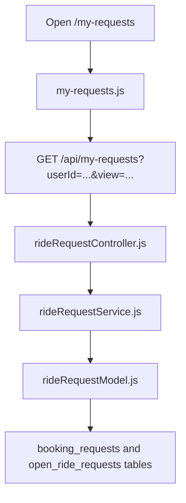
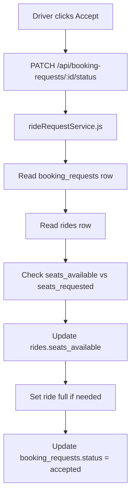

# My Requests Flow

This page is where pending request work happens.

It has two views:

- Rider View
- Driver View

## Role rule

The page now respects role:

- `rider` can only use Rider View
- `driver` can only use Driver View
- `both` can use both

## Main file list

- `public/pages/my-requests.html`
- `public/assets/js/my-requests.js`
- `src/routes/rideRequestRoutes.js`
- `src/controllers/rideRequestController.js`
- `src/services/rideRequestService.js`
- `src/models/rideRequestModel.js`

## Rider View

Rider View shows:

- requests sent on existing rides
- open ride requests created by the rider

These come from:

- `booking_requests`
- `open_ride_requests`

## Driver View

Driver View shows:

- requests on posted rides owned by the current driver
- open rider requests

This is where the driver accepts or declines things.

## Main flow diagram

## Booking request accept flow

This is the flow when a driver accepts a rider who requested an existing ride.

## Important logic already implemented

- duplicate ride requests are blocked
- owner cannot request own ride
- driver-only user cannot request rides
- accepted request reduces ride seats
- overbooking is blocked
- once accepted, the old accept button is not shown anymore

## `Ignore` meaning

There are 2 different ideas of ignore here.

### Existing ride request ignore

For a booking request on your own posted ride, ignore can exist as a state because only that driver is looking at it.

### Open rider request ignore

For an open rider request, ignore is only visual on the screen.

It does not save a global ignored status because other drivers should still be able to accept it.

## Why this page is useful

This page is a good place for pending request work because:

- it keeps rider and driver logic in one place
- it avoids building a large dashboard
- it separates pending request work from accepted ride activity
