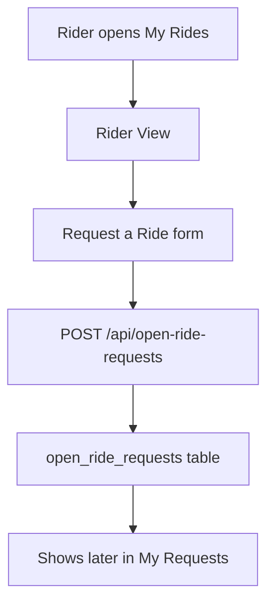
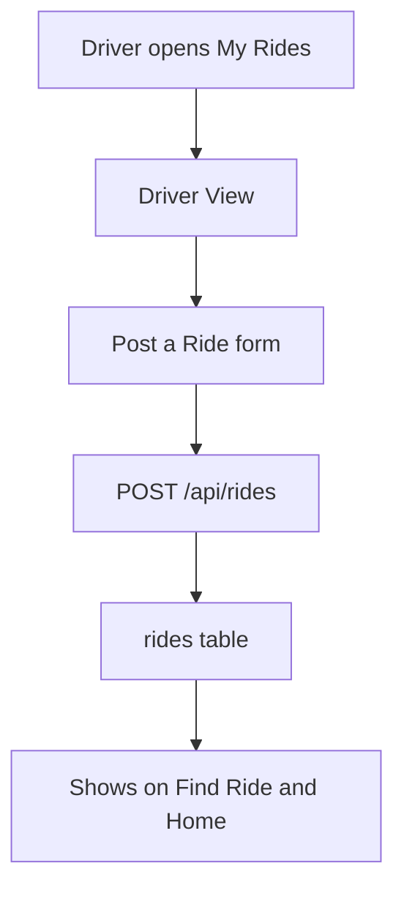

# My Rides Flow

This page is more about active and accepted ride activity.

It also holds the main creation actions:

- `Request a Ride`
- `Post a Ride`

## Role rule

The page now respects role:

- `rider` can only use Rider View
- `driver` can only use Driver View
- `both` can use both

## Main file list

- `public/pages/my-rides.html`
- `public/assets/js/my-rides.js`
- `src/routes/rideRoutes.js`
- `src/controllers/rideController.js`
- `src/services/rideService.js`
- `src/models/rideModel.js`
- `src/routes/rideRequestRoutes.js`
- `src/services/rideRequestService.js`

## Rider View

Rider View shows:

- `Request a Ride`
- accepted booking rides
- accepted open ride requests

The form saves to:

- `open_ride_requests`

## Driver View

Driver View shows:

- `Post a Ride`
- upcoming posted rides
- accepted rider requests

The form saves to:

- `rides`

## Flow for `Request a Ride`

## Flow for `Post a Ride`

## Important vehicle rule

Before a driver posts a ride, the user should have a saved vehicle.

The page now warns the user if:

- no vehicle is selected

That is why the recommended order is:

1. save profile
2. save vehicle
3. post ride

## How accepted rides appear here

### Rider side

Accepted ride bookings come from:

- `booking_requests` where status is `accepted`

Accepted rider-posted requests come from:

- `open_ride_requests` where the driver accepted

### Driver side

Posted rides come from:

- `rides`

Accepted rider requests come from:

- accepted `open_ride_requests`

## Why `My Rides` is not the same as `My Requests`

This page is for active or accepted ride activity.

It can be understood like this:

- `My Requests` = pending things
- `My Rides` = real ride activity

That separation keeps the app easier to understand.
