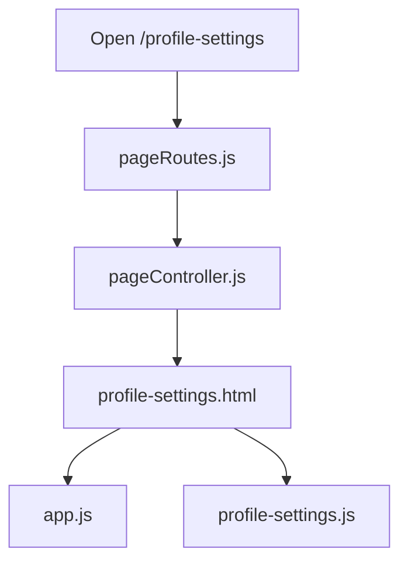
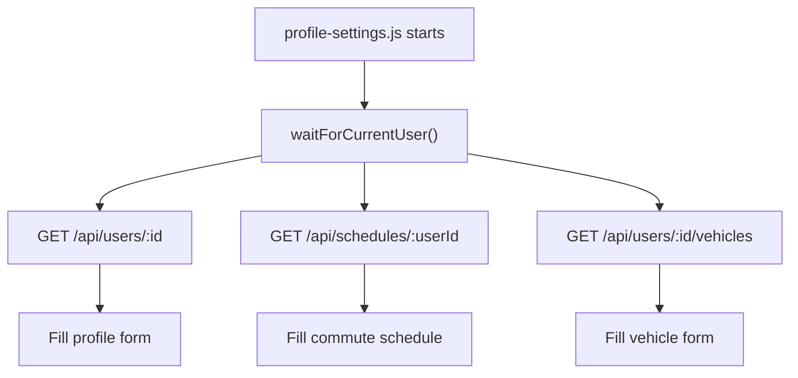
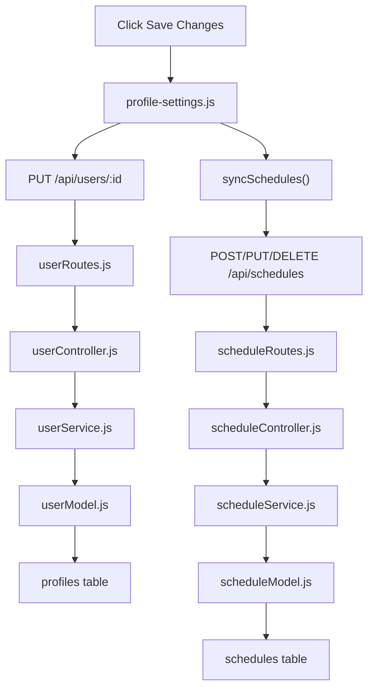
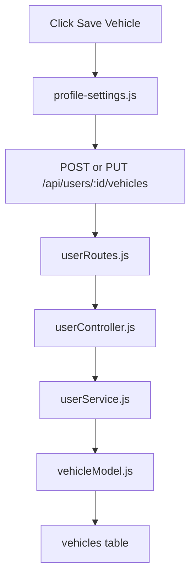

# Profile Page Flow

This is the most detailed doc because the Profile page connects many parts together.

## Main file list

Frontend:

- `public/pages/profile-settings.html`
- `public/assets/js/profile-settings.js`
- `public/assets/js/app.js`
- `public/components/navbar.html`
- `public/assets/css/app.css`

Backend:

- `src/routes/pageRoutes.js`
- `src/controllers/pageController.js`
- `src/routes/userRoutes.js`
- `src/controllers/userController.js`
- `src/services/userService.js`
- `src/models/userModel.js`
- `src/routes/scheduleRoutes.js`
- `src/controllers/scheduleController.js`
- `src/services/scheduleService.js`
- `src/models/scheduleModel.js`
- `src/models/vehicleModel.js`

Tables:

- `profiles`
- `schedules`
- `vehicles`

## Page flow from browser to database

## Top part of the page

At the top there is:

- shared navbar
- logout access from the shared navbar
- profile header card
- profile stats

The navbar comes from `app.js` and `navbar.html`.

The active user now comes from login session and shared auth state.

## What `app.js` does here

`app.js` is important because it:

- loads the navbar
- checks auth state
- keeps shared session state available
- exposes `window.HopinSession`

That means the Profile page does not guess who the user is.  
It asks the shared app state.

## Page flow after load

## Page sections from top to bottom

### 1. Profile header

This shows:

- avatar
- name
- role
- home area
- rating

This is display-only.

### 2. `Profile Settings` and `My Vehicle`

These are tab buttons.

They do not load a new page.  
They only show or hide the correct panel using JavaScript.

### 3. `I want to`

This is the role selection section.

It saves one of these values:

- `rider`
- `driver`
- `both`

The buttons update a hidden input, and that value gets saved to the `profiles` table.

### 4. Personal Details

This saves:

- full name
- email
- phone

Rating is shown here, but not edited here.

### 5. Location

This saves:

- `home_area`

The dropdown uses Regina neighbourhood names.

### 6. Typical Commute Schedule

This section saves to the `schedules` table, not the `profiles` table.

Each active day becomes one schedule row.

That is why one user can have many schedule rows.

### 7. Notes

This saves to:

- `profiles.commute_notes`

### 8. My Vehicle tab

This saves to the `vehicles` table.

Right now the page mainly uses one vehicle, but the database design still allows more than one later.

## Save flow for profile form

## Save flow for vehicle tab

## Why this page uses 3 tables

### `profiles`

This is the main personal info table.

### `schedules`

This is separate because one user can have many commute rows.

### `vehicles`

This is separate because vehicle data is a different type of data and can grow later.

## In one sentence

The Profile page is basically:

`shared logged-in user + profile form + commute schedule form + vehicle form`

all joined together on one page.
