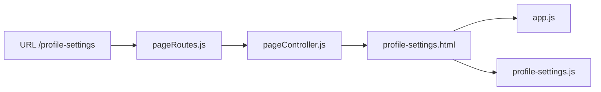

# HopIn Project Structure

This structure stays close to MVC and simple enough for learning.

## Main idea

The frontend shows pages.  
Routes connect URLs.  
Controllers handle request and response.  
Services hold logic.  
Models talk to Supabase.

## Folder shape

```text
Project-App
  /docs
  /public
    /assets
      /css
      /js
    /components
    /pages
  /src
    /config
    /controllers
    /models
    /routes
    /services
    app.js
  /supabase
  server.js
  README.md
```

## Backend structure

```text
/src
  /config
    db.js

  /controllers
    pageController.js
    userController.js
    rideController.js
    rideRequestController.js
    ratingController.js
    scheduleController.js
    messageController.js

  /services
    userService.js
    rideService.js
    rideRequestService.js
    ratingService.js
    scheduleService.js
    messageService.js

  /models
    userModel.js
    vehicleModel.js
    rideModel.js
    rideRequestModel.js
    ratingModel.js
    scheduleModel.js
    messageModel.js

  /routes
    pageRoutes.js
    userRoutes.js
    rideRoutes.js
    rideRequestRoutes.js
    ratingRoutes.js
    scheduleRoutes.js
    messageRoutes.js
```

## Frontend structure

- `public/pages`
  full pages like Home, Find Ride, My Requests, My Rides

- `public/components`
  shared pieces like the navbar

- `public/assets/js`
  page scripts and shared script

- `public/assets/css`
  shared styling

## One simple request example


## One simple page example



## Why `services` stayed in the project

The `services` folder stayed because:

- it matches the architecture style we discussed
- it makes logic easier to move out of controllers
- it keeps the controller files smaller

## Why there are separate request tables

This project does not use just one generic request table.

It uses:

- `booking_requests`
- `open_ride_requests`

This is easier to understand because:

- one is for joining an existing ride
- one is for posting a new rider request
