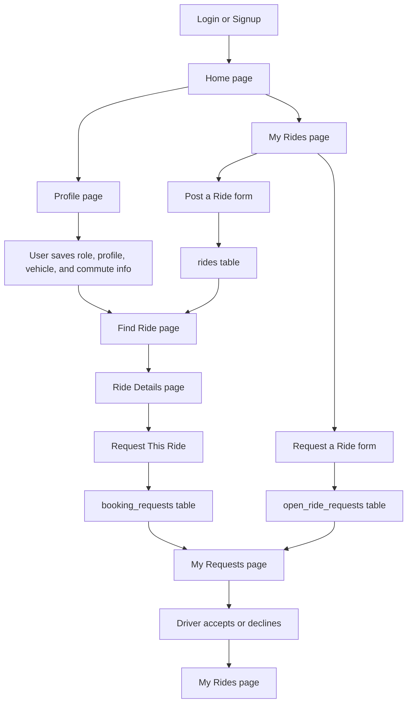
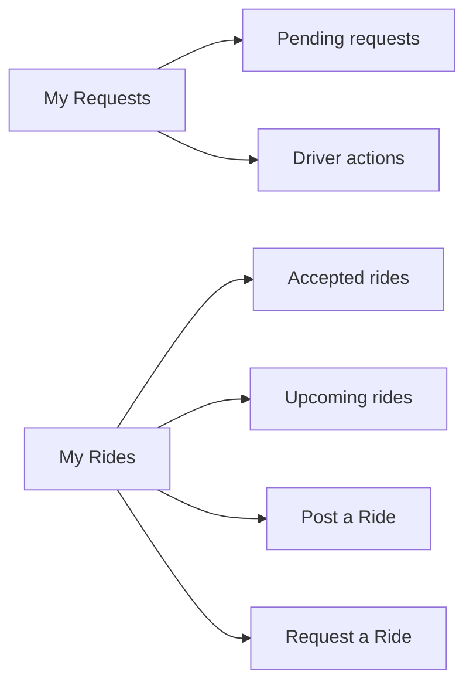

# HopIn User Flow

This doc is the big-picture flow of the app.

This was written as a product overview, not as a file-by-file explanation.

## Main idea

HopIn supports 2 main ride situations:

1. a driver posts a ride and a rider requests a seat on it
2. a rider posts a new ride request and a driver accepts it

Because of that, the app has:

- `rides`
- `booking_requests`
- `open_ride_requests`

## Main pages

- Login
- Signup
- Home
- Find Ride
- Ride Details
- My Requests
- My Rides
- Profile Settings

## Big workflow diagram

## Flow 1: Driver posts a ride

1. User is in `driver` or `both`
2. User opens `My Rides`
3. User goes to `Driver View`
4. User opens `Post a Ride`
5. User submits the form
6. Data goes into `rides`
7. The ride shows on `Find Ride`

## Flow 2: Rider requests an existing ride

1. User is in `rider` or `both`
2. User opens `Find Ride`
3. User opens one ride
4. User clicks `Request This Ride`
5. Data goes into `booking_requests`
6. The rider sees it in `My Requests -> Rider View`
7. The driver sees it in `My Requests -> Driver View`
8. Driver accepts or declines
9. If accepted, it appears in `My Rides`

## Flow 3: Rider posts a new ride request

1. User is in `rider` or `both`
2. User opens `My Rides`
3. User goes to `Rider View`
4. User opens `Request a Ride`
5. Data goes into `open_ride_requests`
6. Drivers see it in `My Requests -> Driver View`
7. A driver can accept it
8. If accepted, it moves into `My Rides`

## Why `My Requests` and `My Rides` are separate

This was an important decision.

`My Requests` is for:

- pending things
- things waiting for acceptance
- driver review actions

`My Rides` is for:

- accepted rides
- upcoming rides
- ride creation actions like `Post a Ride` and `Request a Ride`

## Simple diagram for those two pages

